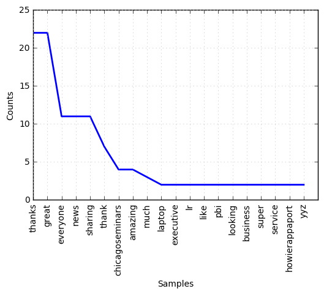
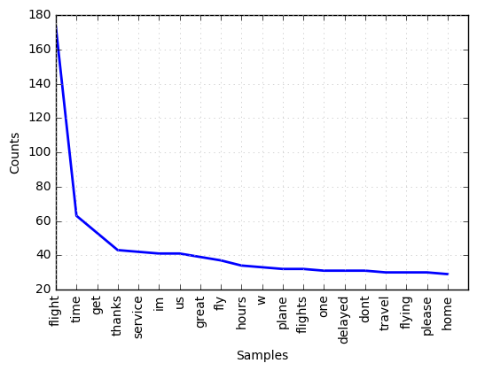

## Twitter Sentiment Analysis
Analyze sentiment of tweets i.e. positive, negative and neutral by applying *convolution neural network* on vector representations of words using *Word2Vec*. US Airline data is used in the demonstration.

### Data
--------
[Airline Twitter sentiment](https://www.crowdflower.com/data-for-everyone/)
>Twitter data was scraped from February of 2015 and contributors were asked to first classify positive, negative, and neutral tweets, followed by categorizing negative reasons (such as “late flight” or “rude service”).

### Prerequisites
-----------------
* [lasagne](http://lasagne.readthedocs.io/en/latest/user/installation.html) - Create conv-net
* [nltk](http://www.nltk.org/install.html) - Data pre-processing
* [sklearn](http://scikit-learn.org/stable/install.html) - Provide useful tools e.g. stratified cross-validation


### Getting Started
-------------------
Begin by creating a directory e.g. *twitter_sentiment* for stroing training data, Word2Vec model and CNN model, and set the FILE_PATH to this directory.
* data: contains training data (airline data in this case) and test data.
* word2vec: word embedding model is saved here.
* model: cnn model is saved here.

### Run
-------
train cnn using *model_airline*,
```
jupyter notebook model_airline.ipynb
```
it could take some time to finish, and when it is done a *cnn.npz* file would be created.

make predictions on twitter data,
```
jupyter notebook predictions.ipynb
```
### Example
-----------
```python
airline_data = Data('Airline-Sentiment-2-w-AA.csv', FILE_PATH)
airline_df = airline_data.csv_df(['airline_sentiment', 'text']) # load data
airline_data.pre_process(airline_df) # pre-process data
airline_df.head()
```
<div>
<table border="1" class="dataframe">
  <thead>
    <tr style="text-align: right;">
      <th></th>
      <th>airline_sentiment</th>
      <th>text</th>
      <th>tokenized</th>
    </tr>
  </thead>
  <tbody>
    <tr>
      <th>0</th>
      <td>neutral</td>
      <td>What  said</td>
      <td>[said]</td>
    </tr>
    <tr>
      <th>1</th>
      <td>positive</td>
      <td>plus youve added commercials to the experienc...</td>
      <td>[plus, youve, added, commercials, experience, ...</td>
    </tr>
    <tr>
      <th>2</th>
      <td>neutral</td>
      <td>I didnt today Must mean I need to take anothe...</td>
      <td>[didnt, today, must, mean, need, take, another...</td>
    </tr>
    <tr>
      <th>3</th>
      <td>negative</td>
      <td>its really aggressive to blast obnoxious ente...</td>
      <td>[really, aggressive, blast, obnoxious, enterta...</td>
    </tr>
    <tr>
      <th>4</th>
      <td>negative</td>
      <td>and its a really big bad thing about it</td>
      <td>[really, big, bad, thing]</td>
    </tr>
  </tbody>
</table>
</div>

model gets trained

```
train freq [1890 2479 2479]
val freq [473 620 620]
Extracting ... 
Extracting ... 
Training cv 1 ...
[LibSVM]0.725627553999


train freq [1890 2479 2479]
val freq [473 620 620]
Extracting ... 
Extracting ... 
Training cv 2 ...
[LibSVM]0.72270869819


train freq [1890 2479 2479]
val freq [473 620 620]
Extracting ... 
Extracting ... 
Training cv 3 ...
[LibSVM]0.72270869819
 ```
 then use it to predict on tweets that mentions AirCanada. 
 
 Group the tweets based on the sentiment classified by CNN model, and we can find the most frequent words from each group,
 
```python
ALL = Prediction(FILE_PATH, 'air.csv', max_len_train=19)
ALL.prepare_data(wv_size=600)
ALL.get_result(n_preview=10, n_top = 20, name='ALL_result',verbose=False)
```

```
===Positive===
[('thanks', 20), ('great', 20), ('everyone', 11), ('sharing', 11), ('news', 11), 
('thank', 7), ('chicagoseminars', 4), ('amazing', 4), ('howierappaport', 2), ('laptop', 2), 
('yyz', 2), ('ready', 2), ('service', 2), ('needed', 2), ('much', 2), ('flight', 2), 
('beat', 2), ('plugs', 2), ('helpful', 2), ('jet', 2)]
```



```
===Negative===
[('flight', 173), ('time', 63), ('get', 53), ('thanks', 45), ('service', 42), 
('im', 42), ('us', 41), ('great', 41), ('fly', 37), ('hours', 34), ('w', 33), 
('plane', 32), ('flights', 32), ('flying', 31), ('one', 31), ('delayed', 31), 
('dont', 31), ('travel', 30), ('please', 30), ('home', 29)]
```




Take a look of the context of some of the most frequent word used in negative grouped tweets,
```python
ALL.check(word='flight', sentiment=3, n_view=10)
```
```
"@AmericanAir with that totally random flight cancellation <ed><U+00A0><U+00BD><ed><U+00B1><U+0080>"
"Baffled by @AmericanAir boarding  passengers with full knowledge that the captain is still on an inbound  flight. SMH. #FAIL"
"#TFW you finally get off your @AmericanAir flight that taxied for over an hour. <ed><U+00A0><U+00BD><ed><U+00B9><U+008C><ed><U+00A0><U+00BC><ed><U+00BF><U+00BE><ed><U+00A0><U+00BC><ed><U+00BE><U+0089><ed><U+00A0><U+00BC><ed><U+00BE><U+0089><ed><U+00A0><U+00BD><ed><U+00B1><U+008F><ed><U+00A0><U+00BC><ed><U+00BF><U+00BD> https://t.co/TyAlTpAWFC"
"@AmericanAir unfortunately made the mistake of booking @united, who put me on an @aircanada flight. Next time! <ed><U+00A0><U+00BD><ed><U+00B8><U+0093>"
"@AmericanAir the flight attend made me stow iPad for landing b/c it "has a keypad". Travel weekly. Never had to stow. Is this new? #AA1164"
"@AmericanAir I have a question about my seats on upcoming flight."
"@AmericanAir I joined Twitter to tell people how bad you are! Second time missing a connecting flight in LA but somehow isn't your fault!"
"RT @RandyStillinger: World War II veterans get a hero's welcome by the #AATeam upon arrival on @AmericanAir #SoaringValor charter flight wi�"
"At LAS with a colleague waiting for our golf clubs because they missed our flight. Might not make our tee time. Unacceptable @AmericanAir"
"@AmericanAir I'm not Ralph ;) That's your awesome flight attendant."
```

This could help airline to improve on relevant services.

### Reference
-------------
[Convolutional Neural Networks for Sentence Classification](https://arxiv.org/pdf/1408.5882.pdf)
